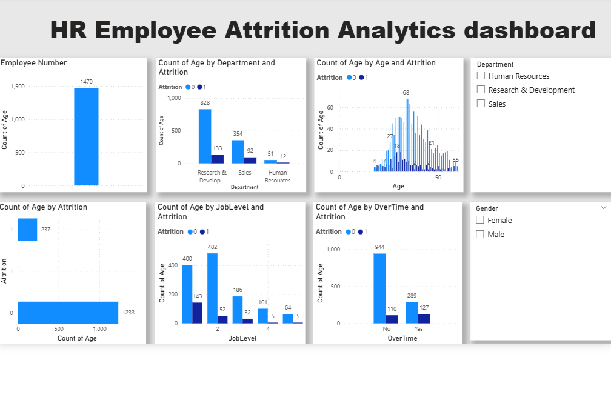

# Employee Attrition Prediction System

## Project Overview

This project predicts employee attrition using machine learning techniques. The goal is to help HR teams identify employees who are at risk of leaving the company.
The project includes data analysis, machine learning modeling, an interactive prediction interface, and a business intelligence dashboard.

## Technologies Used
>Python
>Pandas
>Scikit-learn
>Streamlit
>Power BI

## Features

• Data preprocessing and feature selection
• Machine learning model training and evaluation
• Attrition prediction interface for HR users
• Interactive dashboard for HR insights

## Model Performance

The Random Forest model achieved 87% accuracy in predicting employee attrition.

## Files in This Repository

HR_Employee_Attrition_Analysis.ipynb → Machine learning workflow
app.py → Prediction interface built using Streamlit
attrition_model.pkl → Trained machine learning model
clean_hr_data.csv → Dataset used for training
HR Attrition Dashboard.pbix → Dashboard built using Power BI

## How to Run the App

Install dependencies
Run the Streamlit application
Enter employee details to predict attrition risk

## Dataset

This project uses the IBM HR Analytics Employee Attrition dataset, which contains employee-related attributes such as age, income, job satisfaction, years at company, and overtime status. The dataset is used to analyze factors influencing employee attrition and to build predictive models.
You can reference the dataset source like
IBM HR Analytics Employee Attrition Dataset.

## Project Structure

HR-Employee-Attrition-Prediction
│
├── HR_Employee_Attrition_Analysis.ipynb   # Data analysis and model training
├── app.py                                 # Streamlit prediction app
├── attrition_model.pkl                    # Trained ML model
├── clean_hr_data.csv                      # Dataset
├── HR Attrition Dashboard.pbix            # Power BI dashboard
└── README.md                              # Project documentation

## Conclusion

This project demonstrates how machine learning can be used to predict employee attrition based on HR analytics data. By combining data preprocessing, predictive modeling, and interactive visualization, the system helps identify employees who may be at risk of leaving the organization. The Streamlit application allows users to input employee details and receive real-time attrition predictions.

## Dashboard Preview

## Streamlit Prediction App

### Low Risk Prediction

### High Risk Prediction

---

Feel free to contribute to this project by forking the repository, exploring the code, and enhancing the predictive modeling capabilities.

Happy modeling!
